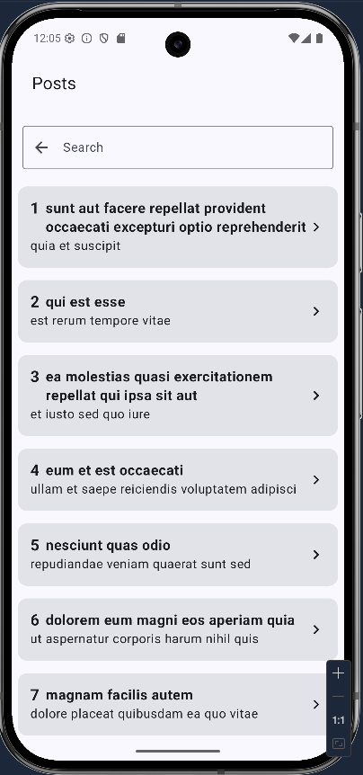
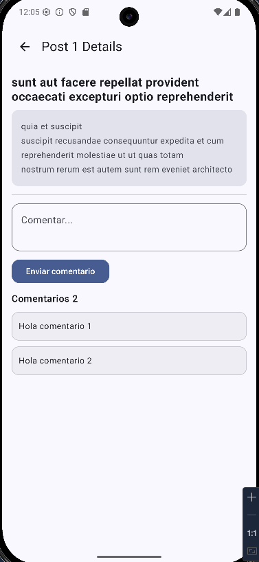
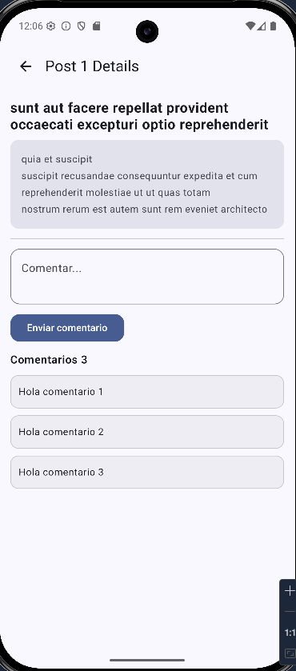
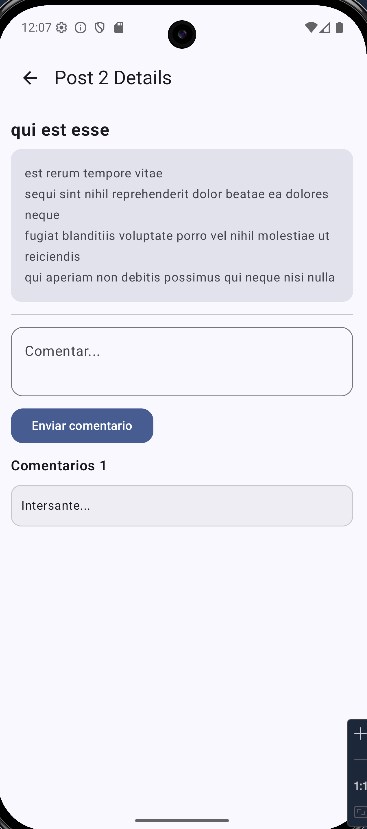

# PostsApp

## Arquitectura

Se utiliza **Clean Architecture** para la estructura general de la aplicación, con 4 componentes principales:

- **Core:** Contiene lo que se comparte a través de la aplicación y de lo cual pueden depender las diferentes capas.
- **Data:** Accesos directos a los datos, modelos para mapeo de respuestas de API y mapeo de entidades a guardar en la base de datos.
- **Domain:** Modelos que utilizan los elementos de UI, casos de uso y definiciones de los repositorios. Aquí vive la lógica de negocio.
- **Presentation:** Todos los composables de UI, componentes y pantallas de la aplicación. Utiliza el patrón de arquitectura MVVM para el manejo de estados y separar la lógica de UI.

## Estructura del proyecto

```
core/
├── base/
├── database/
├── di/
├── events/
├── extensions/
└── navigation/

data/
├── database/
├── dataSources/
├── di/
├── models/
└── repositoriesImpl/

domain/
├── models/
├── repositories/
└── useCases/

presentation/
├── ui/
│   ├── components/
│   ├── screens/
│   └── theme/
└── viewModels/
```

## Librerías utilizadas

### Navigation

```kotlin
implementation(libs.androidx.navigation.compose)
```

Soporte para navegación con Jetpack Compose.

### Retrofit

```kotlin
implementation(libs.retrofit)
implementation(libs.retrofit.gson)
```

Para realizar los llamados a API.

### Logging

```kotlin
implementation(libs.logging.okhttp)
```

Para poder ver las peticiones HTTP que se realizan mediante Retrofit.

### Hilt

```kotlin
implementation(libs.hilt.android)
implementation(libs.hilt.navigation)
annotationProcessor(libs.hilt.compiler)
kapt(libs.hilt.compiler)
```

Para el manejo de inyección de dependencias.

### Room

```kotlin
implementation(libs.androidx.room.runtime)
implementation(libs.androidx.room.ktx)
ksp(libs.androidx.room.compiler)
```

Para implementar la base de datos local.

## Decisiones técnicas tomadas

## Cómo escalaría la aplicación

- Se puede implementar las diferentes capas en módulos independientes, los cuales permiten que las capas estén separadas realmente y no solo por carpetas.
- Validar que los datos que se cachean en base de datos se extraigan principalmente de ahí y se actualicen cuando sea necesario (reducción de llamados a APIs).
- Mejorar el UI, agregar más funcionalidades para gestionar comentarios como editar o eliminarlos.

## Qué mejoraría si tuviera más tiempo

- Implementar KMM para que la aplicación pueda correr en otros dispositivos.
- Mejorar el traer los posts desde la base de datos siempre y no desde la API al cargar la app.
- Agregar tests más completos.

## Cómo ejecutar el proyecto

### Requisitos

- Android Studio
- JDK 17
- Android SDK (compileSdk 36, minSdk 28, targetSdk 35)

### Clonar

```bash
git clone https://github.com/AlfonsHoz/postsApp
```

### Ejecutar

1. Abrir el proyecto en Android Studio
2. Sync Gradle
3. Run en emulador o dispositivo con versión de Android compatible

## Screenshots

### Listado de posts



### Detalle de post con sus comentarios



### Al agregar un comentario



### Post con comentarios diferentes guardados

